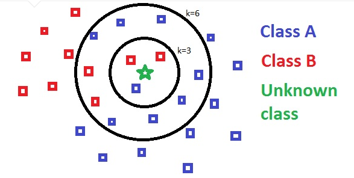

<h1>ALGORITHME K-NEAREST Neighbors</h1>

---

## Petit résumé

- La méthode des K plus proches voisins (KNN) a pour but de classifier des points cibles en fonction de leurs distances par rapport à des points constituant un échantillon d’apprentissage.

## Objectifs

- Prédire les classes d’un ensemble de données d'iris.
- Avoir la meillieur accuracy possible tout en évitant l'overfitting.

## Techno

- Python
- Spyder

## Auteur

- [@Pierre](https://github.com/Pierre-Portfolio)